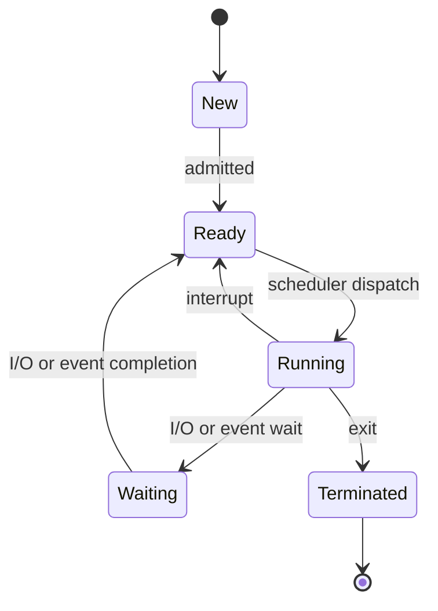
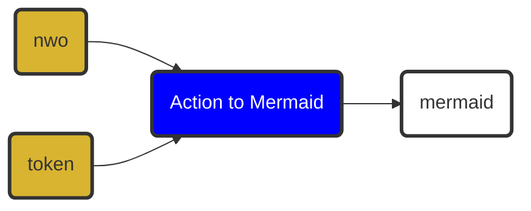
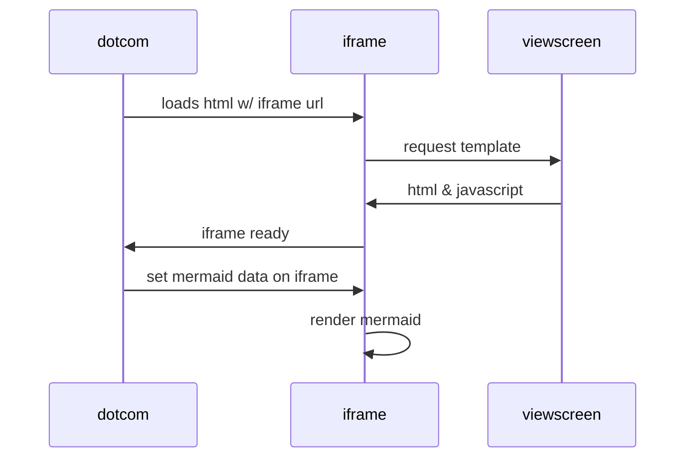
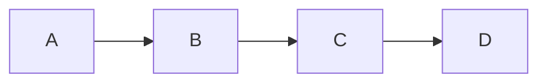

Test diagram

```mermaid
graph TD;
    A-->B;
    A-->C;
    B-->D;
    C-->D;
```

```mermaid
stateDiagram-v2
 [*] --> New
 New --> Ready: admitted
 Ready --> Running: scheduler dispatch
 Running --> Ready: interrupt
 Running --> Waiting: I/O or event wait
 Waiting --> Ready: I/O or event completion
 Running --> Terminated: exit
 Terminated --> [*]
```

```mermaid
flowchart LR
input1(nwo):::optional-->action(Action to Mermaid):::action
input2(token):::optional-->action(Action to Mermaid):::action
action(Action to Mermaid)-->output1(mermaid):::output
classDef required fill:#6ba06a,stroke:#333,stroke-width:3px
classDef optional fill:#d9b430,stroke:#333,stroke-width:3px
classDef action fill:blue,stroke:#333,stroke-width:3px,color:#ffffff
classDef output fill:#fff,stroke:#333,stroke-width:3px,color:#333
```

```mermaid
sequenceDiagram
    participant dotcom
    participant iframe
    participant viewscreen
    dotcom->>iframe: loads html w/ iframe url
    iframe->>viewscreen: request template
    viewscreen->>iframe: html & javascript
    iframe->>dotcom: iframe ready
    dotcom->>iframe: set mermaid data on iframe
    iframe->>iframe: render mermaid
```

```mermaid
flowchart LR;
    A-->B;
    B-->C;
    C-->D;
    click A callback "Tooltip for a callback"
    click B "http://www.github.com" "This is a tooltip for a link"
    click A call callback() "Tooltip for a callback"
    click B href "http://www.github.com" "This is a tooltip for a link"
```
